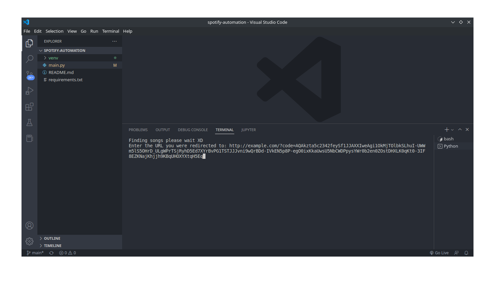

# Spotify Automation

_By hearing songs of any particular time, it is really nice way to jogging your memories for any particular time point in your life. This automation project exactly help in that. You can have top 100 songs of any point of your life and make playlist of it._

A terminal based spotify automation. It will find top 100 songs of any 
date and will add it to your spotify account by creating new playlist.

## Initial setup
```
1. Sign in / Sign up to Spotify Dashboard
https://developer.spotify.com/dashboard/login
2. Create new app
3. edit settings > set redirect url and website to **http://example.com**
4. save
```
## environment setup for linux
```
1. open cmd
2. git clone git@github.com:viralRupani/spotify-automation.git
3. cd spotify-automation
4. python3 -m venv venv
5. source venv/bin/activate
6. pip install -r requirements.txt
7. copy your client id and client app from https://developer.spotify.com/dashboard/applications
8. paste them to main.py
9. remove line 6 from environ import environ
```

## environment setup for windows
```
1. open terminal
2. git clone git@github.com:viralRupani/spotify-automation.git
3. cd spotify-automation
4. python -m venv venv
5. cd venv/scripts
6. activate
7. cd ../..
8. pip install -r requirements.txt
9. copy your client id and client app from https://developer.spotify.com/dashboard/applications
10. paste them to main.py
11. remove line 6 from environ import environ
```

``
now run your file using python main.py into your terminal, enter random date for example "2004-04-23" it will open page of spotify
agree it, after agreeing it copy that page's url that starts with example.com... and paste it to your terminal
``




**after completing this process it will find top 100 songs of that day and will add it to your spotify account by making new playlist. now you can make as many playlist as you want of top songs of your desired time.**
